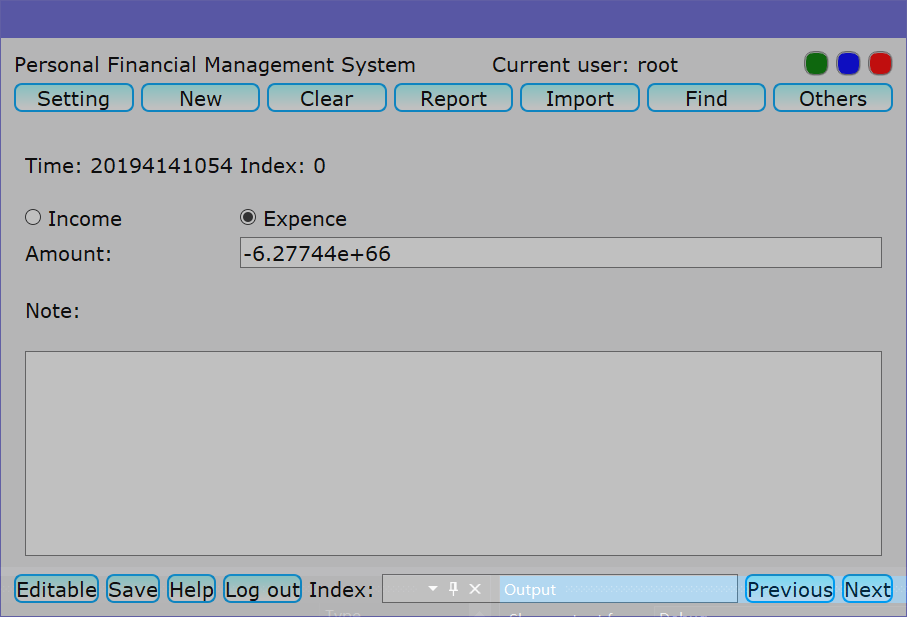

## Try it youself
+ [v0.1](https://github.com/songwonderful/personal-financial-management-system/releases/download/0.1/v0.1.zip)

## Notice
+ This is a toy project that attempts to provide financial management services.
+ The project urgently needs refactoring

## Environment
+ Visual Studio Community 2017
+ Qt Visual Studio Tools **2.3.2**
+ **Qt 5.11.2 msvc2017_64**
+ Windows 10 64 bit

## Screenshot

